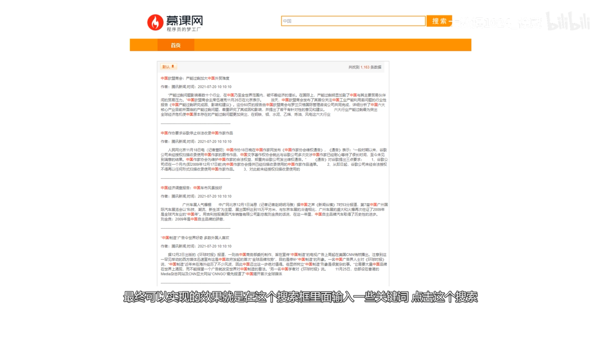
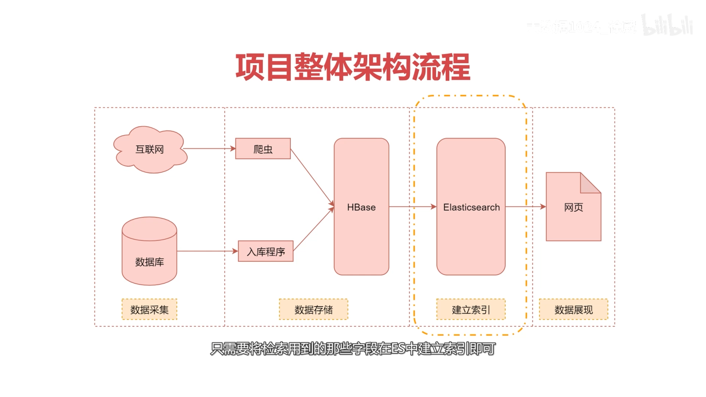
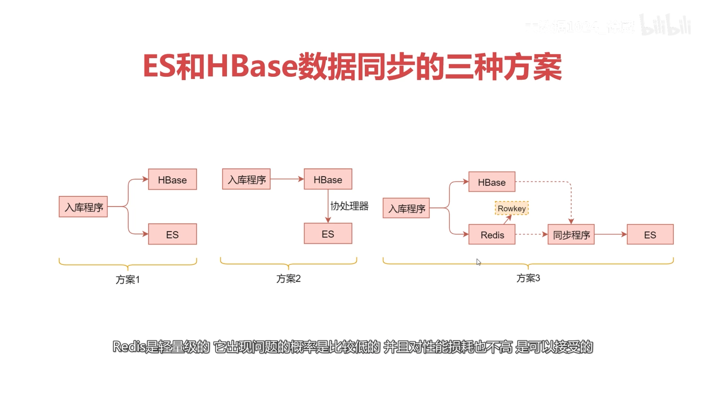
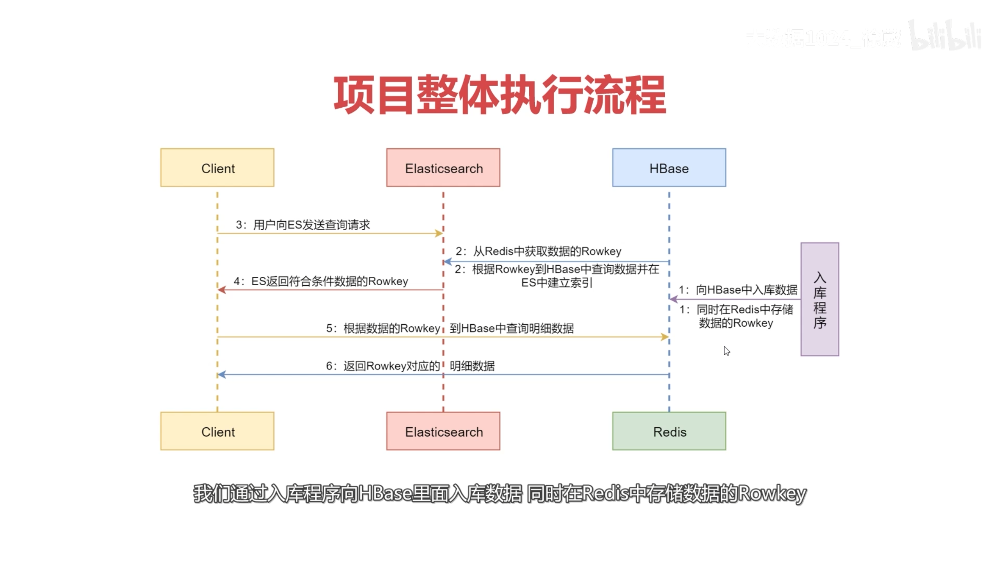
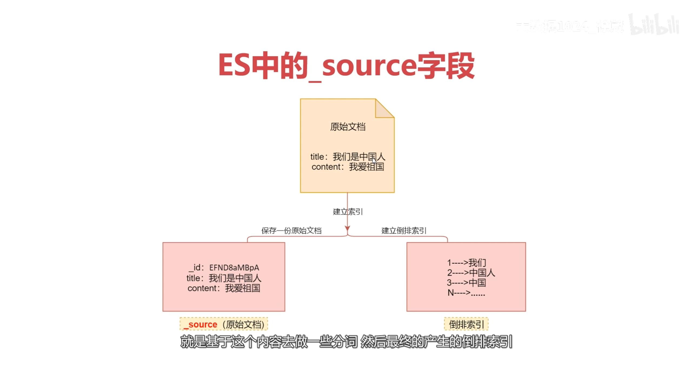
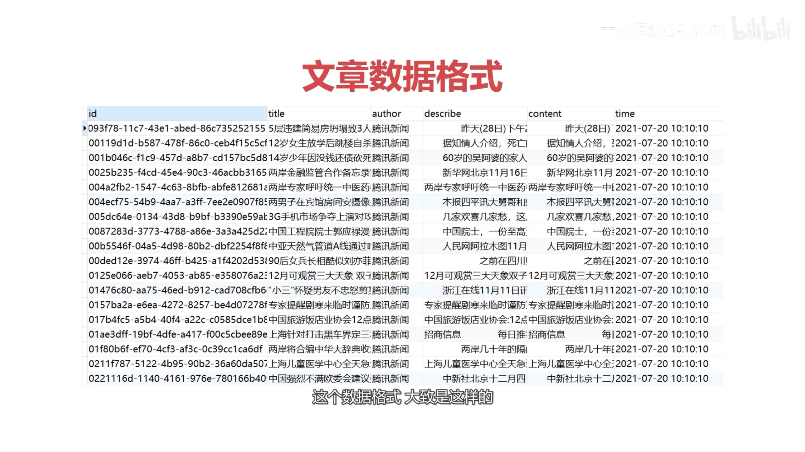

# bigdata-search-toy

- Reference

  [elastic](https://www.elastic.co/cn/elasticsearch), [es docs](https://www.elastic.co/guide/index.html), [Elasticsearch Guide](https://www.elastic.co/guide/en/elasticsearch/reference/index.html), 
  
  hbase


## 背景介绍

- 目标

  仿百度搜索引擎

  ES, HBase

  


### 大数据存储 分析 查询 (盘点)

- 大数据任务

  数据**存储**：

  数据**分析**：

  快速复杂**查询**：全文检索引擎

  


---

- 大数据 **存储**系统

- `HDFS`：文件系统；

  文本类型数据*海量存储*、不支持修改和删除 (批处理 一次写入多次读取场景)

  hive sql 数据分析

- `HBase`：nosql数据库；

  基于*Rowkey查询*效率极高、普通字段查询效率低 (随机读写 修改删除场景)

  不支持sql语法 不适合数据分析

- `Kudu`：折中方案；

  应对*快速变换的数据*进行*快速分析* (增删改查)

  基于sql的海量数据分析 定位于OLAP和少量的OLTP

---

- 大数据 sql**分析**工具

- `Hive`：通过sql对hdfs海量数据进行分析

  不适合单条任务的随机查询 (每次查询底层MR)

- `Impala`：自己实现底层的计算引擎 (内存)

  不适合快速复杂查询 (每次查询都全表扫表)

- `Kylin`：海量数据亚秒级查询 (预聚合)

  适合查询条件固定的需求 不适合灵活多变的查询需求

---

- 全文**检索**引擎 (对数据分词建立索引 支持快速复杂查询)

- `Lucence`：java开源搜索引擎

  使用繁琐 不支持分布式 无法应对海量数据

- `Solr`：对Lucence的封装 提供界面操作 

  4.0支持分布式

- `Elasticsearch`：对Lucence的封装

  支持分布式 为大数据而生


### 项目需求分析

- 场景

  企业爬虫 **文章数据** (海量存储 + 数据更新；快速复杂查询)

- 目标任务

  海量数据存储 + 快速复杂查询

- 技术选型

  `Elasticsearch7.13.4`：*快速复杂查询*、不擅长海量数据存储  ✔

  `HDFS`：海量存储、不支持更新操作  X

  `HBase`：*海量存储*、*根据Rowkey随机查询性能高*(文章id查文章信息)  ✔

  `Kudu`：海量存储、随机查询性能不如 X

  => Elasticsearch + HBase


### 架构设计

- 效果图

  列表页

  详情页

  

- 架构设计

  数据采集：数据源(网络爬虫 内部数据库)、采集传输

  数据存储：HBase

  建立索引：Elasticsearch

  数据展示：网页前后端

  

- 核心难点

  如何在ES里同步对HBase中的数据建立索引 (*数据同步* 建立索引)


### 核心业务

- ES和HBase数据同步的三种方案

- *原始数据在入库HBase时*，同时对ES中数据建立索引

  具体：入库HBase和ES的代码放在一个事务，保证数据一致性

  优点：操作方便

  缺点：耦合性太高 (ES故障则HBase操作也失败 ES压力过大则HBase效率很低)

- 原始数据入库HBase时，通过*HBase协处理器*实现数据同步

  具体：协处理器监听HBase的新增和删除操作，在协处理器内部操作ES

  优点：方便获取HBase中的变化数据

  缺点：过于依赖HBase (后期HBase集群版本升级 无法确保协处理器可用性

- 原始数据入库HBase时，同时加入*Redis*作为Rowkey数据的协作  ✔

  具体：在Redis模拟队列来存储HBase数据中的Rowkey(入库HBase和Redis操作放在一个事务)；而后通过同步程序从Redis队列读取Rowkey 到ES建立索引

  优点：入库HBase和ES建立索引的解耦，借助中间层Redis实现

  缺点：入库HBase和Redis功能的耦合 (Redis轻量级 出问题概率低 性能损耗不大)

- 另外一种方案：*kafka消息队列*，HBase一个消费者组，ES一个消费者组

  

  


### 整体流程

- 项目整体执行流程

  数据导入：**入库程序到HBase**、*Redis*中存储Rowkey数据

  同步ES：获取Redis的Rowkey、根据Rowkey获取HBase详情数据、到**ES建立索引**

  列表页：用户发送查询请求到ES、ES根据条件返回数据id(HBase Rowkey)

  详情页：根据Rowkey到HBase查明细数据、HBase返回对应Rowkey的明细数据

  


### 开发步骤

- 项目开发步骤

  调用接口获取数据、导入HBase和Redis (存储Rowkey)

  通过ES对HBase中的数据建立索引

  对接web项目，提供网页检索功能


### ES高级特性扩展

- ES的`_source`字段

  原始文档

  倒排索引

  

- ES字段的`index`和`store`属性

  index：是否在ES中建立索引，默认true

  store：是否在ES中存储，默认false (否则重复存储)

- demo

  ```
  // 向es添加一批学生信息
  // 学生(姓名、年龄、性别、家庭住址)
  
  // 需求
  // 根据姓名、家庭住址查询，返回姓名、年龄、性别
  // 
  // 分析
  // ES建立索引：姓名、家庭住址 (要条件查询)
  // ES存储：姓名、年龄、性别 (要返回结果)
  //
  // 		是否建立索引	是否存储
  // 姓名		✔		✔
  // 年龄		X		✔
  // 性别		X		✔
  // 住址		✔		X
  
  // 在mapping中设置
  // "_source":{"excludes":["address"]}
  
  ```

  实操

  [Query and filter context](https://elastic.co/guide/en/elasticsearch/reference/7.13/query-filter-context.html) 

  ```bash
  # create
  curl -H "Content-Type: application/json" -XPUT 'http://hadoop102:9200/stuinfo' -d'{"mappings":{"_source":{"excludes":["address"]},"properties":{"name":{"type":"text","index":true},"age":{"type":"integer","index":false},"sex":{"type":"text","index":false},"address":{"type":"text","index":true}}}}'
  
  curl -H "Content-Type: application/json" \
    -XPUT 'http://hadoop102:9200/stuinfo' \
    -d'{
      "mappings":{
        "_source":{"excludes":["address"]},
        "properties":{
          "name":{"type":"text","index":true},
          "age":{"type":"integer","index":false},
          "sex":{"type":"text","index":false},
          "address":{"type":"text","index":true}
        }
      }
    }'
  
  curl -H "Content-Type: application/json" \
       -XPUT 'http://hadoop102:9200/stuinfo' \
       -d '{
               "mappings": {
                   "_source": {
                       "excludes": ["address"]
                   },
                   "properties": {
                       "name": {
                           "type": "text",
                           "index": true
                       },
                       "age": {
                           "type": "integer",
                           "index": false
                       },
                       "sex": {
                           "type": "text",
                           "index": false
                       },
                       "address": {
                           "type": "text",
                           "index": true
                       }
                   }
               }
           }'
  
  
  # create check
  curl -XGET 'http://hadoop102:9200/stuinfo/_mapping?pretty'
  
  
  # insert data
  curl -H "Content-Type: application/json" \
    -XPUT 'http://hadoop102:9200/stuinfo/_doc/1' \
    -d '{"name:"zhangsan","age":20,"sex":"man","address":"shanghai"}'
  
  # select 
  curl -XGET 'http://hadoop102:9200/stuinfo/_search?pretty'
  # check index
  curl -H "Content-Type: application/json" \
    -XGET 'http://hadoop102:9200/stuinfo/_search?pretty' \
    -d '{"query":{"match":{"address":"shanghai"}}}'
  # check index
  curl -H "Content-Type: application/json" \
    -XGET 'http://hadoop102:9200/stuinfo/_search?pretty' \
    -d '{"query":{"match":{"sex":"man"}}}'
  
  
  ```

  


## 项目初始化

- 项目环境

  hadoop, zookeeper, hbase, redis, es


---

- db_fullsearch

- db_fullsearch\data_manager (数据管理)

  utils: EsUtil, HBaseUtil, HttpUtil, RedisUtil

  core: DataImport, DataIndex

- db_fullsearch\web_fullsearch (java web)

  


### 工具类 HttpUtil


### 工具类 EsUtil


### 工具类 HBaseUtil

- HBaseUtil

- 获取连接

  ```
  private static Connection conn = getConn();
  
  private static Connection getConn() {
      conf.set("","");  // hbase zk  // hbase hdfs
      Connection co = ConnectionFactory.createConnection(conf);
      return co;
  }
  
  public static Connection getInstance() {
      return conn;
  }
  
  ```

- 创建表

  ```
  public static void createTable(String tableName, String... cfs){
      Admin admin = conn.getAdmin();
      
      cfArr = cfs.for{cfArr.add(_)}
      tableDesc = TableDescriptorBuilder
          .newBuilder(tableName: TableName)
          .setColumnFamilies(cfArr).build();
          
      admin.createTable(tableDesc);
      admin.close();
  }
  ```

- 添加数据

  ```
  public static void put2HBaseCell(
          String tableName, String rowKey,
          String columnFamily, String column, String value
  ) {
      Table table = conn.getTable(tableName: TableName);
      
      Put put = new Put(rowKey: Bytes);
      put.addColumn(columnFamily: Bytes, column: Bytes, value: Bytes);
      
      table.put(put);
      table.close();
  }
  
  
  public static void put2HBaseList(String tableName, List<Put> list) {
      Table table = conn.getTable(tableName: TableName);
      
      table.put(list);
      table.close();
  }
  
  ```

- 获取数据

  ```
  public static Map<String, String> getFromHBase(String tableName, String rowKey) {
      Table table = conn.getTable(tableName: TableName);
      Get get = new Get(rowKey: Bytes);
      Result result = table.get(get);
      List<Cell> cells = result.listCells();
      
      resMap = cells.for{resMap.put(column_bytes, value_bytes)}
      return resMap;
  }
  ```

  


### 工具类 RedisUtil


## 数据采集 (爬虫工程师)

- 数据源

  爬虫

  数据接口

- 数据格式 (文章)

  

  ```
  // 文章(标题、描述、正文)
  // 
  // ES的id是特殊字段，必须存储且建立索引
  // 列表页展示：标题、作者、描述、时间
  //
  // 			是否建立索引	是否存储
  // 文章id			✔		✔
  // 标题			✔		✔
  // 作者			X		✔
  // 描述			✔		✔
  // 正文			✔		X
  // 时间			X		✔
  
  ```

  实操  [dynamic](https://www.elastic.co/guide/en/elasticsearch/reference/7.13/dynamic.html) 

  ```
  vim article.json
  
  ```

  article.json 

  ```json
  {
      "settings":{
          "number_of_shards":5,
          "number_of_replicas":1
      },
      "mappings":{
          "dynamic":"strict",
          "_source":{"excludes":["content"]},
          "properties":{
              "title":{"type":"text","analyzer":"ik_max_word"},
              "author":{"type":"text","index":false},
              "describe":{"type":"text","analyzer":"ik_max_word"},
              "content":{"type":"text","analyzer":"ik_max_word"},
              "time":{"type":"date","index":false,"format":"yyyy-MM-dd HH:mm:ss"},
          }
      }
  }
  ```

  


## 数据存储 ★

- DataIndex

  ```java
  package com.imooc.core;
  
  import com.alibaba.fastjson.JSONArray;
  import com.alibaba.fastjson.JSONObject;
  import com.imooc.utils.HBaseUtil;
  import com.imooc.utils.HttpUtil;
  import com.imooc.utils.RedisUtil;
  import org.slf4j.Logger;
  import org.slf4j.LoggerFactory;
  import redis.clients.jedis.Jedis;
  
  /**
   * 通过接口获取文章数据，入库HBase和Redis（Rowkey）
   * <p>
   * 注意：HBase建表语句 create 'article','info'
   * Created by xuwei
   */
  public class DataImport {
      private final static Logger logger = LoggerFactory.getLogger(DataImport.class);
  
      public static void main(String[] args) {
  
          String dataUrl = "http://data.xuwei.tech/a1/wz1";  // 通过接口获取文章数据
          JSONObject paramObj = new JSONObject();
          paramObj.put("code", "J2F686AE61D4BEBF1");  // 校验码
          paramObj.put("num", 1000);  // 数据条数，默认返回100条，最大支持返回1000条
  
          JSONObject dataObj = HttpUtil.doPost(dataUrl, paramObj);
          boolean flag = dataObj.containsKey("error");
  
          if (!flag) {
              JSONArray resArr = dataObj.getJSONArray("data");
              for (int i = 0; i < resArr.size(); i++) {
                  JSONObject jsonObj = resArr.getJSONObject(i);
                  // System.out.println(jsonObj.toJSONString());
  
                  // 文章ID 作为HBase的Rowkey 和ES的ID
                  String id = jsonObj.getString("id");
                  String title = jsonObj.getString("title");
                  String author = jsonObj.getString("author");
                  String describe = jsonObj.getString("describe");
                  String content = jsonObj.getString("content");
                  String time = jsonObj.getString("time");
                  Jedis jedis = null;
  
                  try {
                      // 将数据入库到HBase
                      String tableName = "article";
                      String cf = "info";
                      HBaseUtil.put2HBaseCell(tableName, id, cf, "title", title);
                      HBaseUtil.put2HBaseCell(tableName, id, cf, "author", author);
                      HBaseUtil.put2HBaseCell(tableName, id, cf, "describe", describe);
                      HBaseUtil.put2HBaseCell(tableName, id, cf, "content", content);
                      HBaseUtil.put2HBaseCell(tableName, id, cf, "time", time);
  
                      // 将Rowkey保存到Redis中
                      jedis = RedisUtil.getJedis();
                      jedis.lpush("l_article_ids", id);
  
                  } catch (Exception e) {
                      // 注意：由于hbase的put操作属于幂等操作，多次操作，对最终的结果没有影响，所以不需要额外处理
                      logger.error("数据添加失败：" + e.getMessage());
                  } finally {
                      // 向连接池返回连接
                      if (jedis != null) {
                          RedisUtil.returnResource(jedis);
                      }
                  }
              }
  
          } else {
              logger.error("获取文章数据失败：" + dataObj.toJSONString());
          }
      }
  }
  
  ```

- HBaseUtil

- RedisUtil


## 建立索引 ★

- DataIndex

  ```java
  package com.imooc.core;
  
  import com.imooc.utils.EsUtil;
  import com.imooc.utils.HBaseUtil;
  import com.imooc.utils.RedisUtil;
  import org.slf4j.Logger;
  import org.slf4j.LoggerFactory;
  import redis.clients.jedis.Jedis;
  
  import java.util.List;
  import java.util.Map;
  
  /**
   * 在ES中对HBase中的数据建立索引
   * Created by xuwei
   */
  public class DataIndex {
      private final static Logger logger = LoggerFactory.getLogger(DataIndex.class);
  
      public static void main(String[] args) {
  
          List<String> rowKeyList = null;
          Jedis jedis = null;
  
          try {
              // 1：首先从Redis的列表中获取Rowkey
              jedis = RedisUtil.getJedis();
  
              // brpop如果获取到了数据，返回的list里面有两列，第一列是key的名称，第二列是具体的数据
              rowKeyList = jedis.brpop(3, "l_article_ids");
              while (rowKeyList != null) {
                  String rowKey = rowKeyList.get(1);
  
                  // 2：根据Rowkey到HBase中获取数据的详细信息
                  Map<String, String> map = HBaseUtil.getFromHBase("article", rowKey);
                  // 3：在ES中对数据建立索引
                  EsUtil.addIndex("article", rowKey, map);
  
  //                // 循环从Redis的列表中获取Rowkey
  //                rowKeyList = jedis.brpop(3, "l_article_ids");
              }
          } catch (Exception e) {
              logger.error("数据建立索引失败：" + e.getMessage());
              // 在这里可以考虑把获取出来的rowKey再push到Redis中，这样可以保证数据不丢
              if (rowKeyList != null) {
                  jedis.rpush("l_article_ids", rowKeyList.get(1));
              }
          } finally {
              // 向连接池返回连接
              if (jedis != null) {
                  RedisUtil.returnResource(jedis);
              }
              // 注意：确认ES连接不再使用了再关闭连接，否则会导致client无法继续使用
              try {
                  EsUtil.closeRestClient();
              } catch (Exception e) {
                  logger.error("ES连接关闭失败：" + e.getMessage());
              }
          }
      }
  }
  
  ```

  


## 数据展示 (javaweb工程师)


## 启动项目

- HBase ES Redis

  ```bash
  # hbase
  
  
  
  # es
  curl -H "Content-Type: application/json" \
    -XPUT 'http://hadoop102:9200/article' \
    -d @article.json
  # check
  curl -XPUT 'http://hadoop102:9200/article/_mapping?pretty' 
  
  
  ```

- DataImport 启动

  ```bash
  # check hbase
  
  
  # check redis 
  
  
  ```

- DataIndex 启动

  ```bash
  
  ```

  

---

- 对接javaweb

  ```
  mvn 
  ```

  


