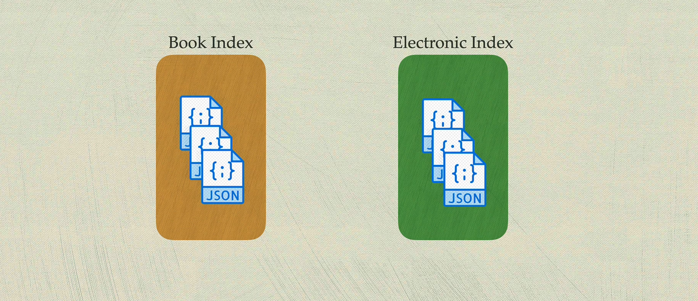
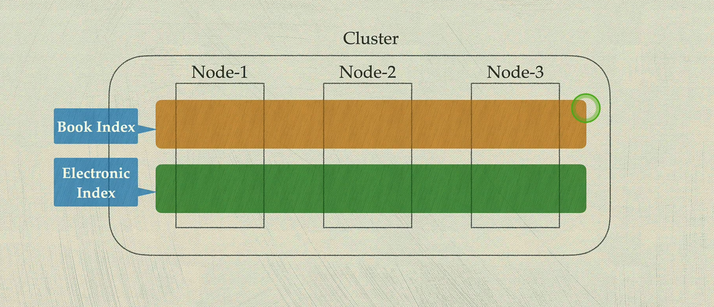
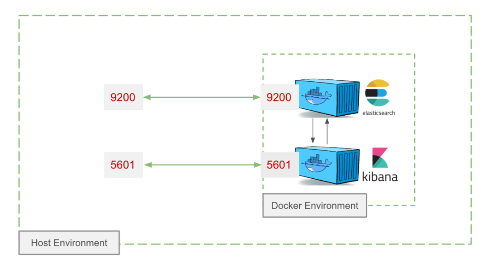
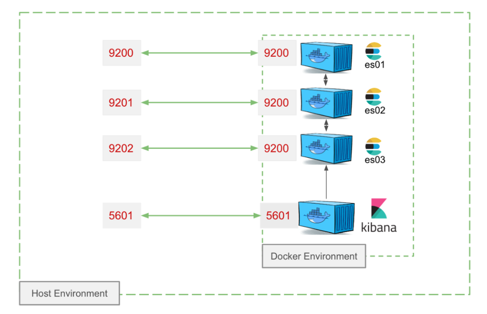
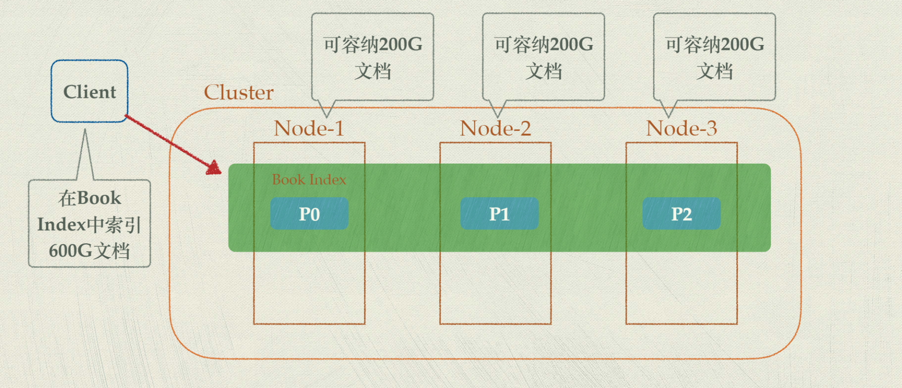
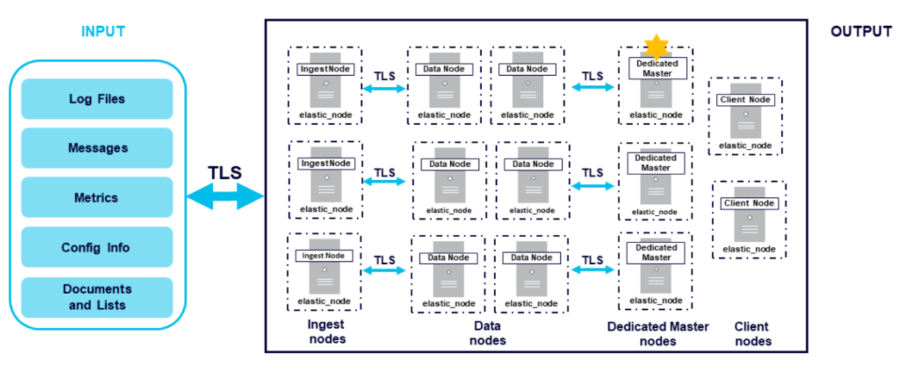

# elasticsearch

- Reference

  [boboweike / elasticsearch_complete_course](https://github.com/boboweike/elasticsearch_complete_course), 


# elasticsearch (zjm)


# elasticsearch (bb)

- 概念

  分布式的搜索 + 分析引擎

  文本、数值、地理位置 

  结构化、半结构化

- 版本

  7.10前 Apache2.0开源

  7.11后 [对商业使用有限制](https://www.elastic.co/blog/elastic-license-update)

  


## 基本概念

- Overview

  一个`es cluster`由若干`node`组成

  es中的`数据`存放在node上，数据是以`document`的形式存放的，document就是json对象

  `index`存放一组相关的document

  


### cluster node

- cluster node

  node隶属一个cluster，node也称为`instance`

  node具有一个唯一`id`和`name`

  node有不同的角色 (`数据节点`)

  node形式：物理机、虚拟机、容器、进程

- 单节点集群 

  演示

  高可用问题、可扩展性(存储空间有限)

- 多节点集群

  

  


### document index

- document

  

- index

  一组相关document的集合，为index

  index是*逻辑概念*，*物理*上分布在不同节点上

  

  

  


## 环境准备

### docker 单节点集群

- Docker

- ~/.wslconfig file

  ```
  [wsl2]
  processors=4
  memory=8GB
  swap=8GB
  localhostForwarding=true
  
  ```

- 规划

  
  
- docker-compose.yml

  ```yml
  version: "3.7"
  services:
    elasticsearch:
      image: "docker.elastic.co/elasticsearch/elasticsearch-oss:7.10.2"
      container_name: elasticsearch
      ports:
        - "9200:9200"
        - "9300:9300"
      environment:
        node.name: es01
        discovery.type: single-node
        cluster.name: mycluster
        ES_JAVA_OPTS: -Xms512m -Xmx512m
      volumes:
        - "es-data-es01:/usr/share/elasticsearch/data"
      ulimits:
        memlock:
          soft: -1
          hard: -1
    kibana:
      image: "docker.elastic.co/kibana/kibana-oss:7.10.2"
      container_name: kibana
      depends_on:
        - elasticsearch
      ports:
        - "5601:5601"
        - "9600:9600"
      environment:
        SERVERNAME: kibana
        ELASTICSEARCH_HOSTS: http://elasticsearch:9200
        ES_JAVA_OPTS: -Xms512m -Xmx512m
  volumes:
    es-data-es01: {}
  
  ```

  启动

  ```bash
  docker compose up
  docker ps
  # http://localhost:9200/
  # http://localhost:5601/
  
  # kibana
  GET /_cluster/health  # 查看es集群的健康状况
  
  ```

  


### docker 三节点集群

- Docker

- 规划

  

- docker-compose.yml

  ```yml
  version: "3.7"
  services:
    es01:
      image: "docker.elastic.co/elasticsearch/elasticsearch-oss:7.10.2"
      container_name: es01
      ports:
        - "9200:9200"
        - "9300:9300"
      environment:
        node.name: es01
        discovery.seed_hosts: es01,es02,es03
        cluster.initial_master_nodes: es01,es02,es03
        cluster.name: mycluster
        ES_JAVA_OPTS: -Xms512m -Xmx512m
      volumes:
        - "es-data-es01:/usr/share/elasticsearch/data"
      ulimits:
        memlock:
          soft: -1
          hard: -1
    es02:
      image: "docker.elastic.co/elasticsearch/elasticsearch-oss:7.10.2"
      container_name: es02
      ports:
        - "9201:9200"
        - "9301:9300"
      environment:
        node.name: es02
        discovery.seed_hosts: es01,es02,es03
        cluster.initial_master_nodes: es01,es02,es03
        cluster.name: mycluster
        ES_JAVA_OPTS: -Xms512m -Xmx512m
      volumes:
        - "es-data-es02:/usr/share/elasticsearch/data"
      ulimits:
        memlock:
          soft: -1
          hard: -1
    es03:
      image: "docker.elastic.co/elasticsearch/elasticsearch-oss:7.10.2"
      container_name: es03
      ports:
        - "9202:9200"
        - "9302:9300"
      environment:
        node.name: es03
        discovery.seed_hosts: es01,es02,es03
        cluster.initial_master_nodes: es01,es02,es03
        cluster.name: mycluster
        ES_JAVA_OPTS: -Xms512m -Xmx512m
      volumes:
        - "es-data-es03:/usr/share/elasticsearch/data"
      ulimits:
        memlock:
          soft: -1
          hard: -1
    kibana:
      image: docker.elastic.co/kibana/kibana-oss:7.10.2
      container_name: kibana
      depends_on:
        - es01
        - es02
        - es03
      ports:
        - "5601:5601"
        - "9600:9600"
      environment:
        SERVERNAME: kibana
        ELASTICSEARCH_HOSTS: '["http://es01:9200","http://es02:9200","http://es03:9200"]'
        ES_JAVA_OPTS: -Xmx512m -Xms512m
  volumes:
    es-data-es01: {}
    es-data-es02: {}
    es-data-es03: {}
  ```

  


## 基本使用

### 查看ES集群状态

- ES暴露HTTP RESTful API，可以通过常用工具进行访问：

  `Kibana Dev Console`, `Postman`, `cURL`

- Kibana Dev Console：

  最简单的访问ES API的方法

  对查询结果进行格式化展示

  自动设置必要的HTTP headers(Content-Type etc)

  请求自动提示/补全

  

---

- Kibana Dev Console 

  ```bash
  # 查询集群健康状态
  GET /_cluster/health
  # _cluster 表示API
  # health 表示命令
  # 不需要告知es的地址 (docker-compose)
  
  
  # 查询节点状态
  GET /_cat/nodes?v
  # cat 表示Compact and aligned text
  
  
  # 查看索引情况
  GET /_cat/indices?v
  
  ```

- cUrl 

  ```bash
  curl -X GET http://localhost:9200
  
  # npm install -g json
  curl -X GET http://localhost:9200/_cluster/health
  curl -X GET http://localhost:9200/_cluster/health | json
  
  ```
  


### sharding分片 (水平扩展)

- sharding

  将一个*物理大索引* 拆分成*若干小索引*

  每一个小索引 称为一个`shard`，一个shard本质上是一个`lucene index`

  index是*逻辑概念*，底层是*若干个shard*，分布在若干节点上 (水平扩展)

  一个shard最多可存放20亿个文档

  

- sharding 主要作用

  支持数据量的水平扩展

  将大物理索引拆成若干小索引，让每个小索引都能存放在一个单独节点上

  提升查询性能 (并行度)

- Kibana 查看shard

  ```bash
  # Kibana 查看shard
  GET /_cat/indices?v
  
  ```

- sharding配置

  一个index缺省配置一个shard (es7.x)，shards本身有成本 (存储开销 管理复杂性)

  增加shards (`Split API`)、减少shards (`Shrink API`) - *数据迁移大动作!!!*

  配置多少个shards？具体场景、每个节点的容量、索引数量/大小、查询模式

  ```
  预期大索引：5 +
  中小索引：1, 2 
  
  监控 + 调整
  
  ```

  


### replication副本


### 红绿灯状态

- 红绿灯状态

  红：部分shard还未被分配到节点(未就绪)，启动状态

  黄：shard已经分配和就绪，但replicas还未被分配到节点(未就绪)

  绿：所有shards和replicas就绪


### 节点角色

- 节点角色

  Master：集群管理

  Data：文档索引/存储/查询

  Ingest：通过pipeline转换数据

  Coordination：转发请求到对应节点 (缺省角色)

  


---

- Master (候选)

  有且只有一个Master候选节点会被选为主Master

  管理任务：创建/删除索引，跟踪节点，Shard/Replica分配等

  可能需要独立Master节点集群(大集群)

  配置：node.roles:[master]

- Data

  执行文档的CRUD操作，Shard/Replica所在节点 (耗内存和磁盘IO的节点)

  小集群：通常节点都赋予Data节点角色

  大集群：Data和Master集群分离

  配置：node.roles:[data]

- Ingest

  执行数据预处理 pipeline (转换数据或者添加额外信息，例如处理Word/PDF文档，IP地址到地理位置解析)

  功能类似Logstash

  大集群推荐独立Ingest节点

  配置：node.roles:[ingest]

- Coordination

  转发请求到对应节点，并返回结果 (类似负载均衡/路由器，也称client节点)

  大集群推荐独立Coordination节点

  配置：node.roles:[] (默认角色 独立)

  

---

- demo

  


### shard大小规划


## 基础使用

### ES文档管理


